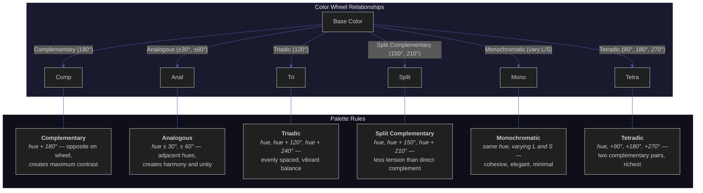

<div align="center">
  
  <br>
  <h1>🎨 Color Palette Generator</h1>

  <p>
    <strong>A polished, zero-dependency color palette generator</strong>
    <br>
    Enter a hex color and instantly generate harmonious palettes — complementary, analogous, triadic, split-complementary, monochromatic, and tetradic.
  </p>

  <p>
    <a href="./LICENSE"></a>
    
    
    <a href="https://github.com/soumendrak/color-palette/pulls"></a>
  </p>

  <p>
    <a href="#features">Features</a> •
    <a href="#demo">Demo</a> •
    <a href="#usage">Usage</a> •
    <a href="#color-relationships">Color Relationships</a> •
    <a href="#license">License</a>
  </p>
</div>

<br>

---

## ✨ Features

- **🎯 Color Picker** — Native color picker + manual hex text input with validation
- **🌈 6 Palette Types** — Complementary, Analogous, Triadic, Split Complementary, Monochromatic, Tetradic
- **📋 Click to Copy** — Click any swatch to copy its hex value to clipboard
- **🔍 Live Preview** — See base color with HEX, RGB, and HSL values
- **🌙 Dark Theme** — Polished dark UI with glass-morphism and smooth animations
- **📱 Fully Responsive** — Works beautifully on desktop and mobile
- **⚡ Zero Dependencies** — Pure HTML, CSS, and JavaScript — no frameworks, no CDN, no build step
- **🚀 Deploy Anywhere** — Single self-contained HTML file, ready for GitHub Pages, Netlify, or any static host
- **🧮 Pure JS Color Math** — HSL conversions and hue rotations calculated entirely client-side

## 🔮 Demo

Open `index.html` in any browser — that's it.

```
📁 color-palette/
├── index.html   ← The complete application (~19 KB, single file)
└── README.md    ← This file
```

## 🚀 Usage

```bash
# Clone the repo
git clone https://github.com/soumendrak/color-palette.git
cd color-palette

# Open directly — no server needed
open index.html
# or
xdg-open index.html
# or simply double-click the file
```

### Deploy to GitHub Pages

1. Push to a GitHub repository
2. Go to **Settings → Pages**
3. Source: **Deploy from a branch**
4. Branch: `main`, folder: `/ (root)`
5. Your site will be live at `https://<username>.github.io/color-palette/`

## 🎨 Color Relationships

The six palette types are based on classic color theory principles. Below is a visual representation of how hues relate on the color wheel.



## 🧪 Color Math

All color conversions are performed in pure JavaScript with no external dependencies:

| Function | Description |
|:--|:--|
| `hexToRgb(hex)` | Convert hex triplet to RGB |
| `rgbToHsl(r, g, b)` | Convert RGB to HSL (0–360°, 0–100%, 0–100%) |
| `hslToRgb(h, s, l)` | Convert HSL back to RGB |
| `rgbToHex(r, g, b)` | Convert RGB to hex triplet |

Palettes are generated by rotating the **hue (H)** channel while keeping saturation (S) and lightness (L) constant, except for **monochromatic** which modulates S and L while keeping H fixed.

## 🛠 Tech Stack

- **HTML5** — semantic markup
- **CSS3** — custom properties, flexbox, animations, responsive design
- **Vanilla JS** — no frameworks, no libraries
- **SVG** — inline favicon data URI

## 📄 License

Licensed under the [MIT License](LICENSE).
---

<div align="center">
  <sub>Built with ❤️ using pure HTML, CSS & JavaScript</sub>
</div>
